# hp-41_isene-rom

The most useful of my FOCAL programs are contained in one 4K ROM image – the ISENE.ROM. The ROM includes:

* UAC (Ultimate Alarm Clock) - The mother of all alarm clocks with all kinds
  of bells and whistles
* TIMER - A simple program for sounding an alarm at a defined interval
* D-W-D - Date to Week number to Date conversions
* REM (REMembering) - PDA event management system
* HOURS - Project hours registration
* NOTES - Quick note taking for the HP-41
* CRYPT - Encrypt/decrypt HP-41 XM ascii files
* EVAL - Program to evaluate decisions agains a set of requirements
* FINANCE - A Time-Value-Money (TVM) program
* EASTER - Get the date for Easter Sunday for a given year
* FILEMAN - Efficient file management system for the HP-41
* FILE - File editing, viewing, printing
* LIBXM - Utilities for handling XM files; Create, resize, sort
* LIBHPX - Utilities for handling HEPAX files; Save/restore data/ascii files, resize
* DMD - Convert between date formats: MM.DD <-> DD.MM
* RNG - Random Number Generator based on TIME as the input

Read the pdf manual for a full overview.

ISENE.ROM was easily created with Håkan Thörngren's NutStudio.

## License
This software is released into the Public Domain.
